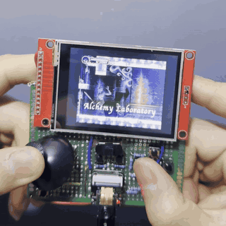

# Castlevania: Symphony of the Night on the ESP32-S3

<a href="https://youtube.com/shorts/qYXikWOWIp0"></a>

Gameplay on the handheld: [watch it on YouTube](https://youtube.com/shorts/qYXikWOWIp0).

A native port of SOTN — not an emulator — running on an ESP32-S3
microcontroller: 240 MHz dual-core Xtensa, 512 KB of internal SRAM, 8 MB of
PSRAM. It is built from this decompilation's portable C, with the PlayStation
SDK replaced by [psyz](https://github.com/Xeeynamo/psyz) and a software
rasterizer written for the chip.

Two targets:

| | Waveshare ESP32-S3-Touch-LCD-2 | DIY handheld (XIAO ESP32S3 Sense) |
|---|---|---|
| Build | `build.ps1` | `build.ps1 xiao` |
| Panel | ST7789, SPI 80 MHz | ILI9341, SPI 40 MHz |
| Game data | FAT partition in flash | microSD |
| Game logic | 60 fps | 50–60 fps |
| Screen | 60 fps | ~55 fps idle, lower while scrolling |

The handheld's wiring, parts list and button map are in
[`hardware/HARDWARE.md`](hardware/HARDWARE.md).

## You need your own disc

Nothing derived from the game is in this repository. You extract the data from
**your own** copy of the US disc (SLUS-00067) with the decomp's normal tooling,
then copy the files the port reads onto the microSD. See the main project
README for extraction, and [`HANDHELD.md`](HANDHELD.md) for the
handheld-specific steps.

## Building

ESP-IDF v5.5. After extracting and generating assets, mark the large read-only
tables `const` so they are placed in flash instead of the 320 KB of DRAM:

```
python esp32/const_stage_tables.py        # nz0, np3 and Richter's sprites
powershell -File esp32/build.ps1 xiao
powershell -File esp32/flash.ps1 COM9 -Xiao
```

That step exists because the generated sources declare art and tile data as
writable; left that way, NP3 alone overflows DRAM by 160 KB. (The WRP and SEL
generated tables were const-ed by hand earlier in the project; a fresh asset
generation may need the same treatment — not yet re-verified from scratch.)

## What works

- Stages statically linked: **NZ0** (Alchemy Laboratory), **NP3** (Castle
  Entrance), **WRP** (warp room) and **SEL** (title / save menu). There is no
  dynamic linker on the chip, so every stage is compiled in, with its colliding
  symbols renamed per stage (`main/stage_dup_syms.cmake`, computed with `nm`
  — the linker silently picks one definition otherwise).
- Sound effects via the SPU emulation; XA music streams from the disc image if
  the `.cue`/`.bin` are on the card.
- Memory card saves, backed by files.

Other stages are not linked yet: walking into one stops at the loading screen.

## Bugs found along the way

Several are latent in the upstream PC port too — a PlayStation silently
tolerates wild reads and writes that fault on a chip with memory protection:

- **Pause menu overflowed the sprite array** (`dra/menu.c`): no bound on
  `g_GpuUsage.sp`; the overflow lands on the second GPU buffer's `next` link and
  the next frame's `ClearOTag` writes into garbage. Found with a hardware
  store-watchpoint on that link.
- **Palette-animation table read out of bounds** in NZ0, registering a sprite
  table as a palette and writing to it every frame.
- **Bat-form spritesheet was a permanent NULL** in the PC port (fixed upstream
  as #3532; cherry-picked).
- **Enemy-name popup** scanned for a PSX string terminator the PC strings don't
  have, overrunning a 64-byte stack buffer.
- **SD and panel share one SPI bus**; the IDF driver asserts if a card command
  starts while a panel DMA is in flight. Arbitrated with a mutex that drains
  the panel's DMA before releasing.
