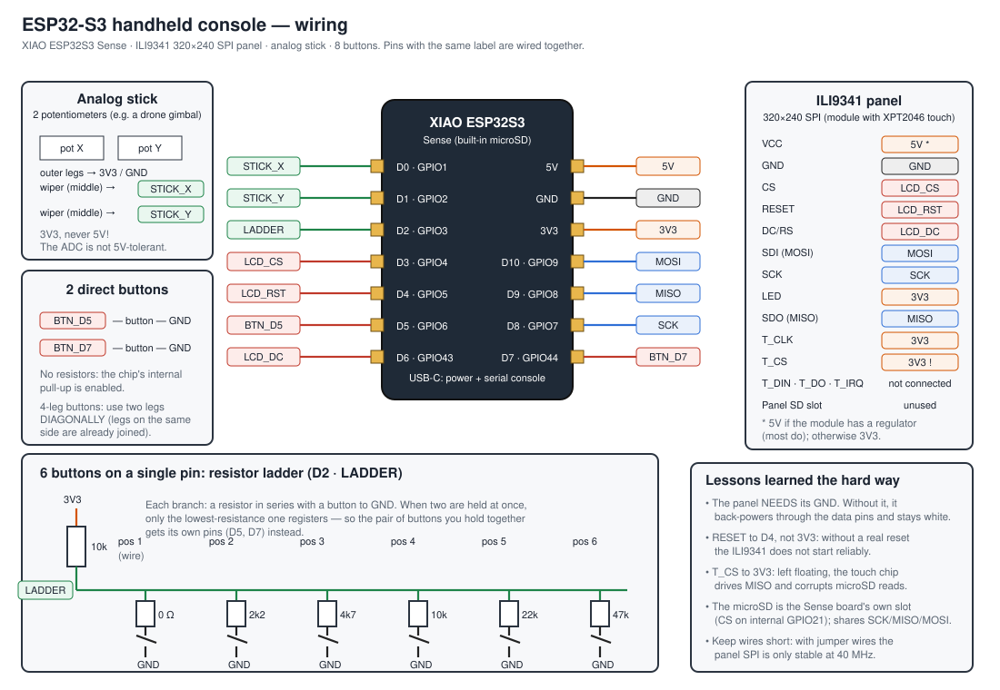
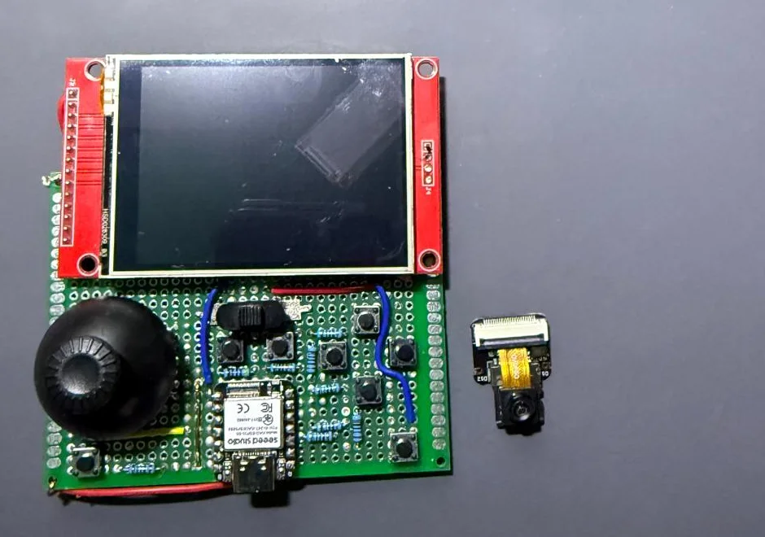
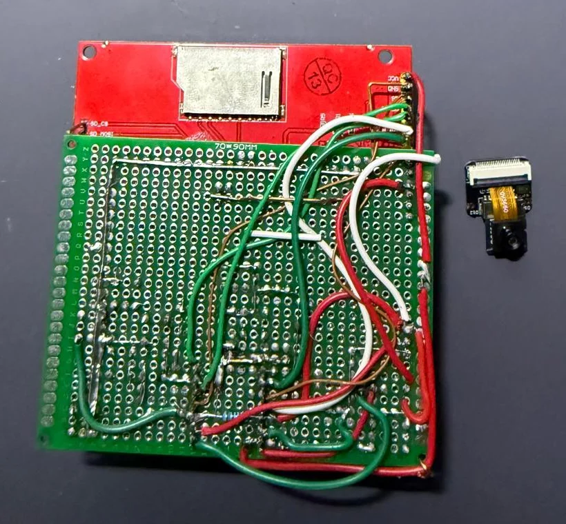

# ESP32-S3 handheld console: build guide

This is the handheld that runs the **Castlevania: Symphony of the Night** and
**Metal Gear Solid** ports. The hardware is identical for both games; only the
PlayStation button each key reports differs (table below).

<!-- PHOTOS: add pictures of the build here -->

  
  

The finished build, front and back. The XIAO's camera module is not used and has been taken off.

## Parts

| Part | Qty | Notes |
|---|---|---|
| Seeed **XIAO ESP32S3 Sense** | 1 | It must be the *Sense*: the microSD slot is on its expansion board. 8 MB PSRAM, 8 MB flash. |
| **ILI9341 320×240 SPI** panel | 1 | The common 2.8"/3.2" module with XPT2046 touch and an SD slot (neither used). 320×240 is these games' native resolution: no scaling. |
| 2-axis analog stick | 1 | A drone-controller gimbal or a joystick module both work. Only the two potentiometers are used. |
| Push buttons | 8 | 4-leg tactile switches are fine (see note). |
| Resistors | 1× 10k (pull-up) + 2k2, 4k7, 10k, 22k, 47k | 5% tolerance is plenty: there is half a volt between steps. |
| microSD card | 1 | FAT32. Holds all the game data. |
| USB-C cable | 1 | Power and serial console. |

## Connections

The **D** numbers are the ones printed on the XIAO, **not** GPIO numbers.
Mixing them up is the easiest way to lose an afternoon, so both are listed.

| XIAO | GPIO | Goes to | Role |
|---|---|---|---|
| D0 | 1 | wiper of potentiometer X | stick X axis (ADC) |
| D1 | 2 | wiper of potentiometer Y | stick Y axis (ADC) |
| D2 | 3 | 6-button ladder | ADC |
| D3 | 4 | panel CS | |
| D4 | 5 | panel RESET | a real reset line, not tied to 3V3 |
| D5 | 6 | button → GND | direct button |
| D6 | 43 | panel DC/RS | |
| D7 | 44 | button → GND | direct button |
| D8 | 7 | panel SCK | shared with the microSD |
| D9 | 8 | panel SDO (MISO) | shared with the microSD |
| D10 | 9 | panel SDI (MOSI) | shared with the microSD |
| 5V | – | panel VCC | use 3V3 if your module has no regulator |
| 3V3 | – | panel LED, T_CLK, T_CS; outer legs of both pots; the 10k pull-up | |
| GND | – | panel GND; outer legs of both pots; all buttons | |

The microSD is the Sense board's own slot: its CS is on GPIO21 (internal) and
it shares SCK/MISO/MOSI with the panel. Nothing to wire.

### The button ladder

Six buttons share pin D2: a 10k resistor from 3V3 to D2 and, from D2, each
button to GND through its own resistor (0 Ω, 2k2, 4k7, 10k, 22k, 47k). Each
button produces a different voltage and the ADC tells them apart.

The catch: **if two are held at once, only the lowest-resistance one
registers**. That is why the pair of buttons each game holds together is on the
dedicated pins D5 and D7.

## Button map

| Physical key | Castlevania SOTN | Metal Gear Solid |
|---|---|---|
| D5 (own pin) | □ square (attack) | □ square (fire) |
| D7 (own pin) | ✕ cross (jump) | R1 (aim) |
| ladder pos 1 (0 Ω) | ○ circle | ○ circle |
| ladder pos 2 (2k2) | R1 | ✕ cross |
| ladder pos 3 (4k7) | △ triangle | △ triangle |
| ladder pos 4 (10k) | L1 | L1 |
| ladder pos 5 (22k) | START | START |
| ladder pos 6 (47k) | SELECT | SELECT |
| stick | d-pad | d-pad |

In SOTN the pair is attack + jump (Alucard attacks mid-air constantly); in MGS
it is fire + aim.

## Mistakes we already made (so you don't)

- **The panel needs its GND.** Without it the panel back-powers through the
  protection diodes on its data pins: it lights up, changes brightness when you
  press buttons, and stays white.
- **RESET to D4, not 3V3.** With RESET tied high and only a software reset,
  the ILI9341 did not start reliably.
- **T_CS to 3V3.** Left floating, the touch controller selects itself and
  drives the MISO line it shares with the microSD.
- **4-leg buttons: use diagonal legs.** The two legs on one side are already
  joined inside; wiring those gives you a button that is always pressed.
- **Potentiometers on 3V3, never 5V.** The ESP32-S3 ADC is not 5V-tolerant.
  The middle leg (wiper) goes to the pin; the outer legs to 3V3 and GND. If an
  axis comes out reversed, fix it in software (`STICK_INVERT_X/Y`), not with a
  soldering iron.
- **Keep wires short.** With jumper wires the panel SPI is only stable at
  40 MHz; at 80 MHz whole bands of the image slip sideways. A short soldered
  harness would probably hold 80.
- **D6 is also UART0 TX.** That is why the serial console runs over native USB
  and the firmware never installs the UART0 driver: doing so would steal the
  panel's data/command pin.

## The stick calibrates itself

At boot it takes whatever it reads as the centre and learns each axis's travel
as you move it. **Don't touch it while powering on.** A drone gimbal does not
rest at mid-scale (this one rested at 2317 of 4095, not 2048), so no range is
assumed.
